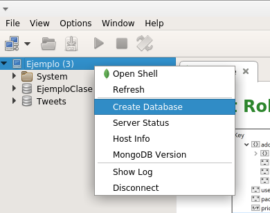

# Guía LABORATORIO III: Introducción a Bases de Datos NOSQL

## Crear una db. 
Con botón derecho sobre la conexión, *crear base de datos*

## Crear una colección
Botón derecho sobre *collections* __Create Collection__

## OPERACIONES CRUD

Ejemplo: cómo armar un documento JSON para importar a la base.

    { 
        "_id": 1,
        "titulo": "Se estrelló un avión en Cuba",
        "cuerpo": "La aeronave cayó a poco de despegar del aeropuerto de La Habana. Era un Boeing 737 de una compañía aérea subsidiaria de Cubana de Aviación. El presidente cubano Miguel Díaz-Canel se dirigió de inmediato al lugar del accidente.",
        "fecha-hora": "2018-05-18 16:00:00"
    }

a) Incorporar un documento desde el shell

    db.documentos.insertOne({ 
        "_id": 1,
        "titulo": "Se estrelló un avión en Cuba",
        "cuerpo": "La aeronave cayó a poco de despegar del aeropuerto de La Habana. Era un Boeing 737 de una compañía aérea subsidiaria de Cubana de Aviación. El presidente cubano Miguel Díaz-Canel se dirigió de inmediato al lugar del accidente.",
        "fecha-hora": "2018-05-18 16:00:00"
    })
    

b) Buscar todos los documentos cargados en la colección.

    db.documentos.find({})

c)Actualizar un atributo con __update__

    db.documentos.update(
        {"_id": 1},
        {$set: {"titulo": "NOTICIA MODIFICADA EN DMUBA"}}
    )

    

